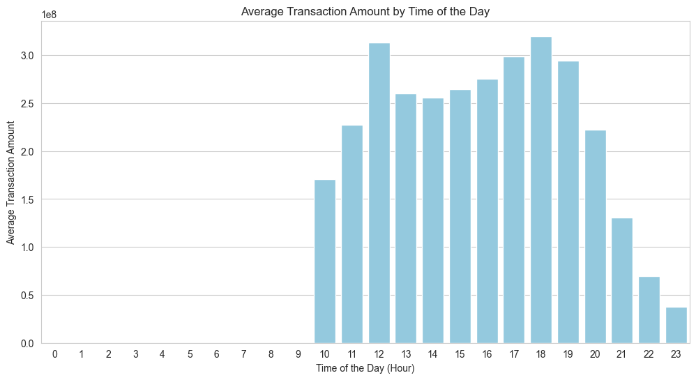
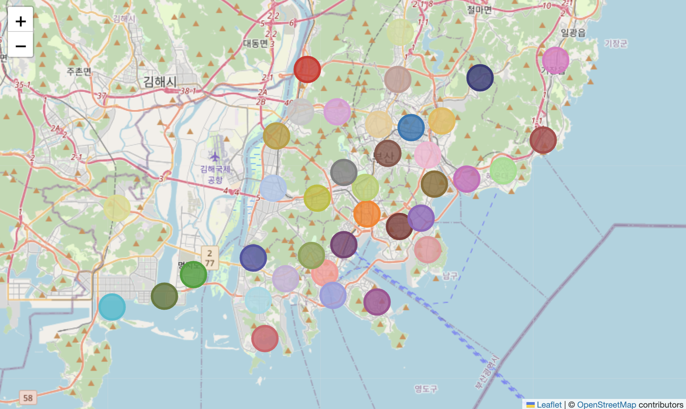

# "부산 동백전 거래 데이터 분석 보고서"

정보컴퓨터공학부 202055623 허치영

- ["부산 동백전 거래 데이터 분석 보고서"](#부산-동백전-거래-데이터-분석-보고서)
  - [1. 서론](#1-서론)
    - [1.1 분석 목적](#11-분석-목적)
  - [2. 데이터셋 및 분석 방법](#2-데이터셋-및-분석-방법)
    - [2.1 데이터셋 개요](#21-데이터셋-개요)
    - [2.2 분석 방법](#22-분석-방법)
  - [3. 분석 결과](#3-분석-결과)
    - [3.1 시간대별 평균 거래 패턴](#31-시간대별-평균-거래-패턴)
      - [\<시간대별 평균 거래량\>](#시간대별-평균-거래량)
      - [\<시간대별 평균 거래 금액\>](#시간대별-평균-거래-금액)
    - [3.2 클러스터링 기반 공간 분석](#32-클러스터링-기반-공간-분석)
      - [\<k-means 클러스터링 결과(k=40)\>](#k-means-클러스터링-결과k40)
      - [\<Centroids 지도\>](#centroids-지도)
      - [3.2.1 클러스터별 거래 금액 분포](#321-클러스터별-거래-금액-분포)
      - [3.2.2 클러스터별 거래 횟수 상위 5개 업종](#322-클러스터별-거래-횟수-상위-5개-업종)
      - [3.2.3 클러스터별 성별 비율](#323-클러스터별-성별-비율)
      - [3.2.4 클러스터별 구매자 출생연도 분포](#324-클러스터별-구매자-출생연도-분포)
  - [4. 결론 및 인사이트](#4-결론-및-인사이트)
    - [4.1 주요 결론](#41-주요-결론)
    - [4.2 한계 및 향후 과제](#42-한계-및-향후-과제)

## 1. 서론

부산 동백전은 지역경제 활성화를 위해 사용되는 지역화폐입니다. 본 과제에서는 2023년 9월 한 달간의 부산 동백전 거래 데이터를 분석하여, 소비 패턴과 지역별 특징을 도출하고, 이를 통해 지역 경제의 특성을 이해하는 것을 목적으로 합니다.

### 1.1 분석 목적

- 시간대별 거래 패턴 분석
- 거래 내역의 공간적 분포 및 특성 분석
- 클러스터별 인구학적 및 소비 패턴 비교
- 지역 경제적 특징 도출 및 인사이트 제공

---

## 2. 데이터셋 및 분석 방법

### 2.1 데이터셋 개요

- 데이터 출처: [집계구 단위 업종별 지역화폐 거래 데이터](https://www.data.go.kr/data/27829985/linkedData.do) - 2023.09_집계구 단위 업종별 지역화폐 거래 데이터
- 데이터 기간: 2023년 9월 1일 ~ 9월 30일
- 총 거래 데이터: 4,756,907건
- 메타데이터:

### 2.2 분석 방법

1. **시각화**: 시간대별 평균 거래 횟수 및 거래 금액 분석
2. **클러스터링**: 거래 위치 기반 K-Means 클러스터링 (k=40)
3. **클러스터별 분석**:
   - 거래 금액 분포
   - 주요 업종 및 소비 패턴 비교
   - 성별 비율 비교
   - 사용자 출생연도 분포 분석
4. **인사이트 도출**: 지역 특성을 반영한 인구학적 및 경제적 패턴 이해

---

## 3. 분석 결과

### 3.1 시간대별 평균 거래 패턴

#### <시간대별 평균 거래량>

- 점심시간(12시)과 저녁시간(18시)에 거래량이 집중됨.
- 저녁시간 이후로 거래량이 급격히 감소함.
- 오전 10시 이전 데이터는 매우 낮은 평균 거래량(약 3.5) 때문에 그래프에서 보이지 않음.

#### <시간대별 평균 거래 금액>

- 거래 금액은 점심시간(12시)과 저녁시간(18시)에 집중됨.
- 저녁시간대의 거래량은 점심시간에 비해 낮았으나 더 높은 거래 금액을 보임.
  - 이는 사람들이 저녁시간에 더 많은 금액을 소비하는 경향이 있다는 것을 의미.
- 마찬가지로, 오전 10시 이전 데이터는 매우 낮은 평균 거래 금액 때문에 그래프에서 보이지 않음.

---

### 3.2 클러스터링 기반 공간 분석

각 거래내역의 위치 정보(위도, 경도)를 기반으로 K-Means 클러스터링을 수행하여, 지역별 소비 패턴과 인구학적 특성을 분석.

#### <k-means 클러스터링 결과(k=40)>

#### <Centroids 지도>

#### 3.2.1 클러스터별 거래 금액 분포

- 비교의 용이성을 위해 outlier(avg + 2std 이상) 제거.
- 클러스터링 결과, 대부분의 클러스터는 유사한 거래 금액 분포를 보임.
- **특이점**: 33번 클러스터는 다른 클러스터에 비해 높은 거래 금액 기록.
  - 이는 33번 클러스터의 위치가 주요 관광지임을 반영.
  - 33번 클러스터의 지도상 위치:

#### 3.2.2 클러스터별 거래 횟수 상위 5개 업종

| 클러스터 번호 | 상위 5개 업종                          |
|---------|-------------------------------------------------|
| 0       | 슈퍼마켓, 일반한식, 편 의 점, 서양음식, 약국     |
| 1       | 편 의 점, 일반한식, 슈퍼마켓, 서양음식, 정육점   |
| 2       | 편 의 점, 서양음식, 일반한식, 슈퍼마켓, 약국     |
| 3       | 슈퍼마켓, 서양음식, 일반한식, 편 의 점, 기타음료식품 |
| 4       | 서양음식, 일반한식, 슈퍼마켓, 편 의 점, 농·축·수산품 |
| 5       | 서양음식, 일반한식, 편 의 점, 약국, 스넥         |
| 6       | 일반한식, 서양음식, 편 의 점, 슈퍼마켓, 약국     |
| 7       | 일반한식, 서양음식, 편 의 점, 슈퍼마켓, 약국     |
| 8       | 일반한식, 편 의 점, 서양음식, 슈퍼마켓, 약국     |
| 9       | 편 의 점, 슈퍼마켓, 일반한식, 서양음식, 약국     |
| 10      | 편 의 점, 일반한식, 서양음식, 슈퍼마켓, 기타음료식품 |
| 11      | 서양음식, 일반한식, 편 의 점, 슈퍼마켓, 스넥     |
| 12      | 슈퍼마켓, 서양음식, 일반한식, 편 의 점, 의원     |
| 13      | 슈퍼마켓, 편 의 점, 서양음식, 일반한식, 기타음료식품 |
| 14      | 슈퍼마켓, 편 의 점, 서양음식, 일반한식, 농·축·수산품 |
| 15      | 일반한식, 편 의 점, 슈퍼마켓, 서양음식, 약국     |
| 16      | 슈퍼마켓, 편 의 점, 서양음식, 일반한식, 약국     |
| 17      | 편 의 점, 서양음식, GS주유소, 슈퍼마켓, 일반한식 |
| 18      | 서양음식, 일반한식, 편 의 점, 슈퍼마켓, 골프연습장 |
| 19      | 편 의 점, 슈퍼마켓, 일반한식, 서양음식, 약국     |
| 20      | 슈퍼마켓, 편 의 점, 서양음식, 일반한식, 스넥     |
| 21      | 편 의 점, 서양음식, 일반한식, 슈퍼마켓, 농·축·수산품 |
| 22      | 편 의 점, 슈퍼마켓, 스넥, 일반한식, 의원         |
| 23      | 편 의 점, 서양음식, 슈퍼마켓, 일반한식, 약국     |
| 24      | 편 의 점, 일반한식, 서양음식, 제과점, 약국       |
| 25      | 편 의 점, 슈퍼마켓, 서양음식, 일반한식, 약국     |
| 26      | 서양음식, 편 의 점, 일반한식, 슈퍼마켓, 농·축·수산품 |
| 27      | 편 의 점, 일반한식, 슈퍼마켓, 서양음식, 기타음료식품 |
| 28      | 편 의 점, 슈퍼마켓, 일반한식, 서양음식, 약국     |
| 29      | 편 의 점, 서양음식, 일반한식, 슈퍼마켓, 기타음료식품 |
| 30      | 슈퍼마켓, 일반한식, 편 의 점, 서양음식, 농·축·수산품 |
| 31      | 일반한식, 편 의 점, 서양음식, 슈퍼마켓, 약국     |
| 32      | 서양음식, 편 의 점, 일반한식, 슈퍼마켓, 약국     |
| 33      | 일반한식, 서양음식, 편 의 점, 슈퍼마켓, 현대정유(오일뱅크) |
| 34      | 서양음식, 편 의 점, 일반한식, 의원, 슈퍼마켓     |
| 35      | 일반한식, 슈퍼마켓, 약국, 편 의 점, 농·축·수산품 |
| 36      | 편 의 점, 서양음식, 일반한식, 슈퍼마켓, 제과점   |
| 37      | 서양음식, 편 의 점, 일반한식, 슈퍼마켓, 택시     |
| 38      | 편 의 점, 서양음식, 슈퍼마켓, 일반한식, 약국     |
| 39      | 서양음식, 슈퍼마켓, 편 의 점, 일반한식, 기타음료식품 |

- 각 클러스터의 거래 횟수 상위 업종을 분석.
- 동백전 카드의 특성상 편 의 점, 슈퍼마켓, 일반한식 등이 상위 업종으로 나타남.
- 33번 클러스터의 경우 현대정유(오일뱅크)가 상위 업종으로 나타남.
  - 이유: 33번 클러스터의 위치는 주요 관광지로, 관광객들의 자동차 주유소 이용이 많기 때문으로 분석.

#### 3.2.3 클러스터별 성별 비율

- 각 클러스터의 남성/여성 비율을 Stacked Bar Plot으로 시각화.
- **결과**:
  - 17번, 22번 클러스터: 높은 남성 비율
    - 두 클러스터 모두 산업단지 지역으로, 남성 근로자 비율이 높은 것으로 분석.
  - 35번 클러스터: 높은 여성 비율
    - 대형 아파트 단지가 존재하는 지역으로, 주부의 소비가 많은 것으로 분석.

#### 3.2.4 클러스터별 구매자 출생연도 분포

- 각 클러스터 별 구매자 출생연도 분포와 클러스터 간 비교를 Box Plot으로 시각화.
- **결과**: 17번 클러스터에서 1980년생의 집중적인 분포 확인. 이는 산업단지 근로자 집중 때문으로 분석.

---

## 4. 결론 및 인사이트

### 4.1 주요 결론

- 시간대별 거래 데이터는 지역 상권 활성화 시간대를 파악하는 데 유용.
- 클러스터링 분석을 통해 지역별 소비 패턴과 인구학적 특성을 효과적으로 구분 가능.
- 특정 지역(관광지, 산업단지, 주거지)의 경제적 특성을 반영하는 소비 패턴과 분포를 확인.

### 4.2 한계 및 향후 과제

- 클러스터의 개수(k)를 40으로 고정했으나, 최적의 k 값을 찾아 추가적인 분석 필요.
- 2023년 9월 데이터만을 사용하여 장기간의 추세를 파악하기 어려움.
- 거래 금액 외에 추가적인 변수(결제 방식, 구매 품목 등)를 활용하면 더욱 풍부한 인사이트 도출 가능.
- 다른 부산지역 인구 데이터와 함께 분석하면, 지역 경제의 특성을 더욱 정확하게 이해 가능.

---

- 데이터 출처: [집계구 단위 업종별 지역화폐 거래 데이터](https://www.data.go.kr/data/27829985/linkedData.do) - 2023.09_집계구 단위 업종별 지역화폐 거래 데이터
- 분석에 사용된 Python 라이브러리: `pandas`, `matplotlib`, `seaborn`, `sklearn`
